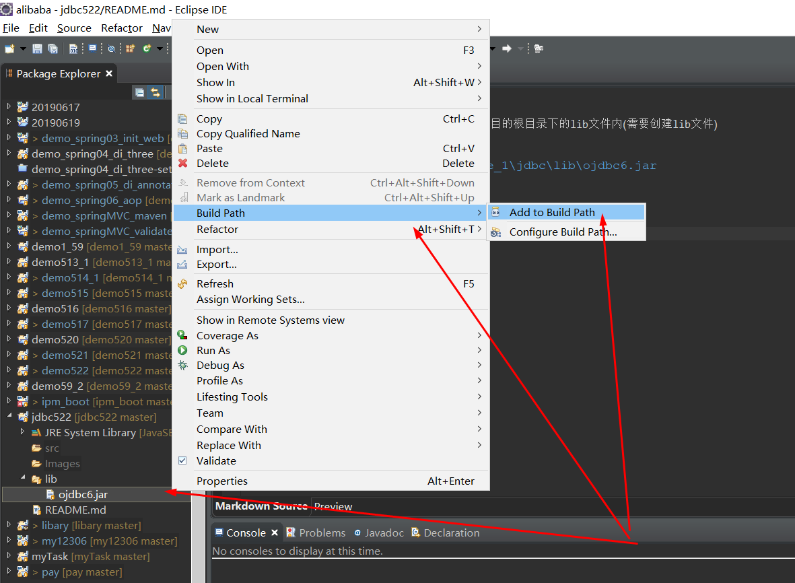
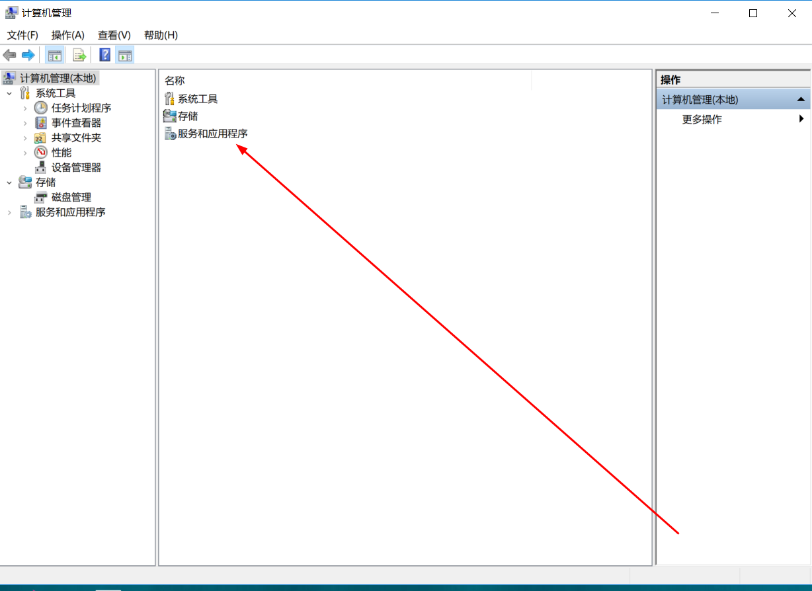
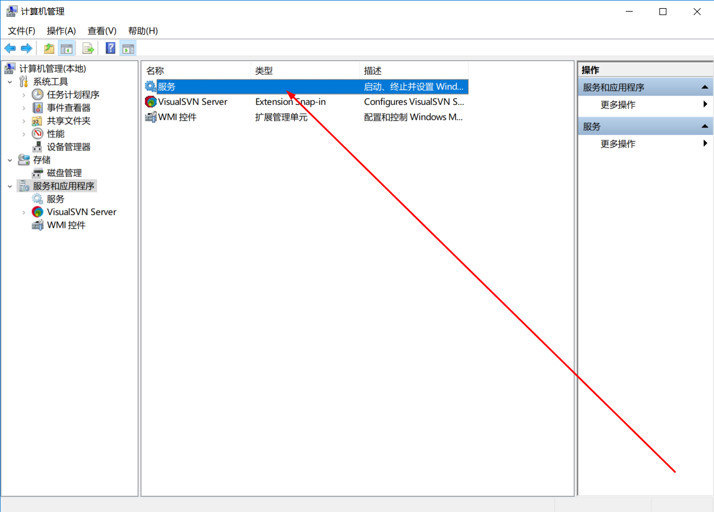
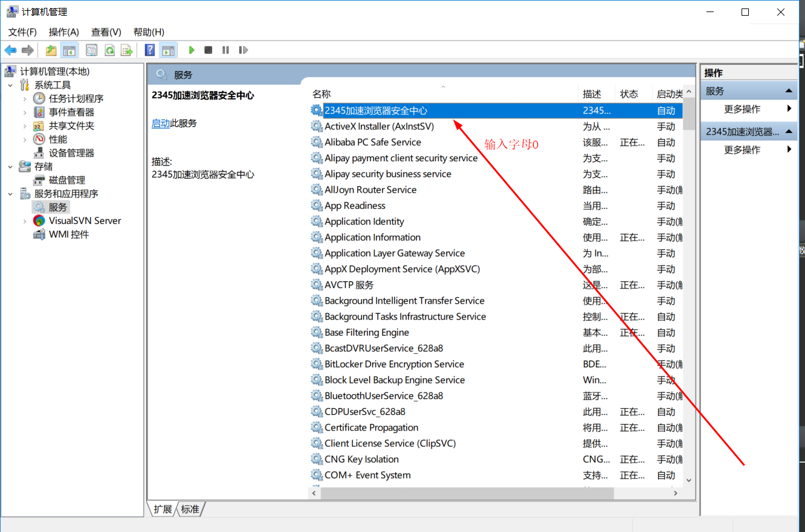
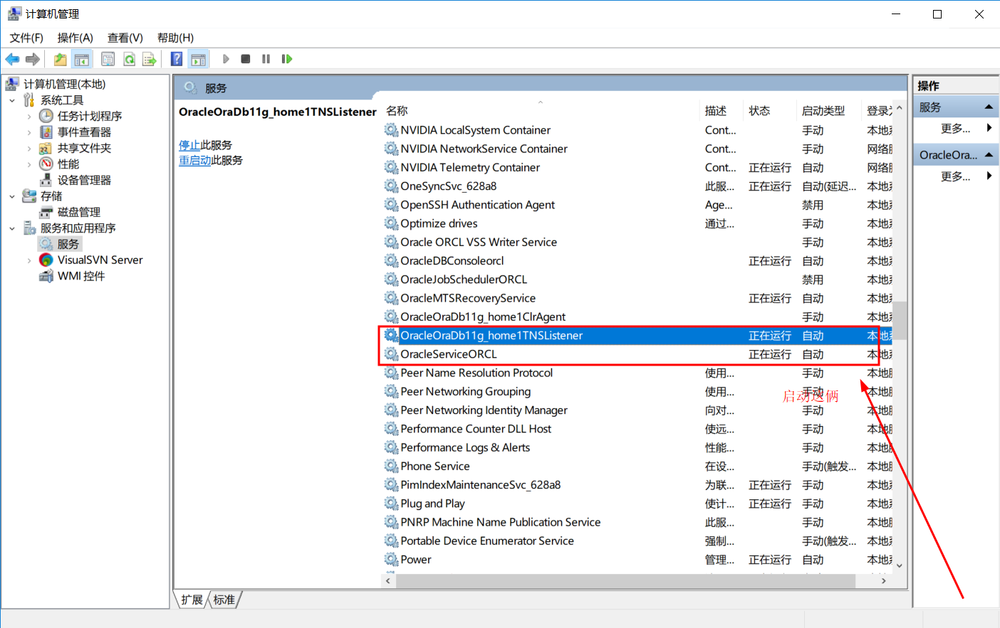
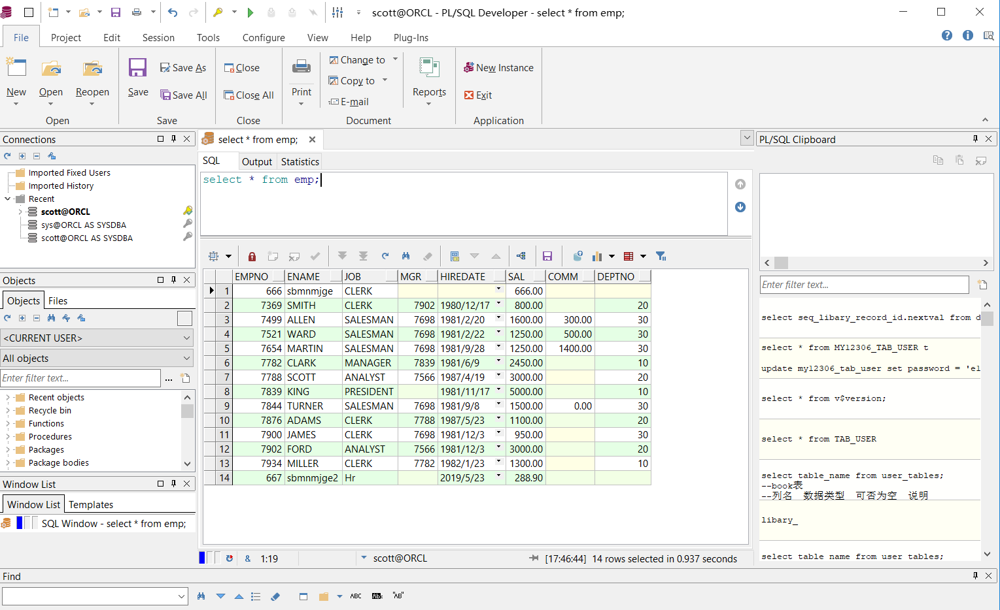

# JDBC与Java数据库编程基础版本

1. 载入JDBC驱动程序,将如下路径的jar包导入项目的根目录下的lib文件内(需要创建lib文件)

```
E:\app\yanbo\product\11.2.0\dbhome_1\jdbc\lib\ojdbc6.jar
```

2. 添加到内路径



3. 启动Oracle







4. 打开 **pl/sql** 工具，测试是否可以操作数据库，如图所示表示可以操作

